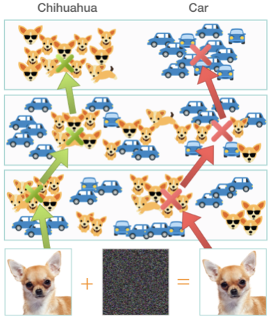
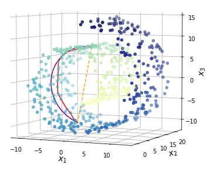
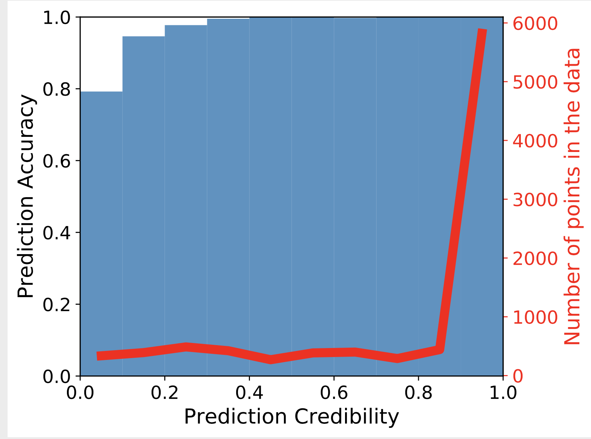

# GEOMETRIC EXTENSIONS TO DkNN

Repository intended to explore extensions to DkNN using geodesic distances.

<p float="center">
  
   
   
</p>

# Conda environment
```console
local_user@local_host$ bash setup.sh
```
# Experiment Config File
Experiment Config File at configs/config_mnist.yaml

# Run original DKNN (from cleverhans)
```console
local_user@local_host$ conda activate dknn_geod
local_user@local_host$ jupyter notebook example.ipynb
```
